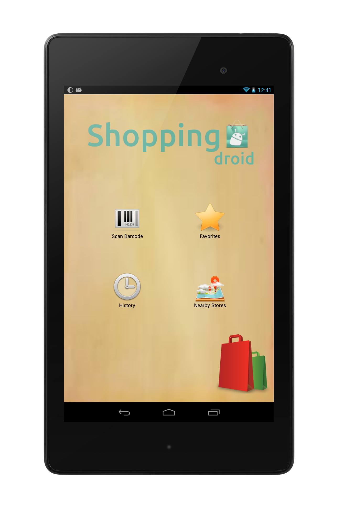
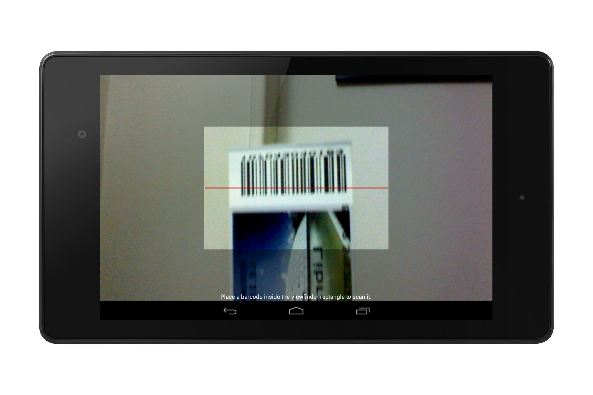
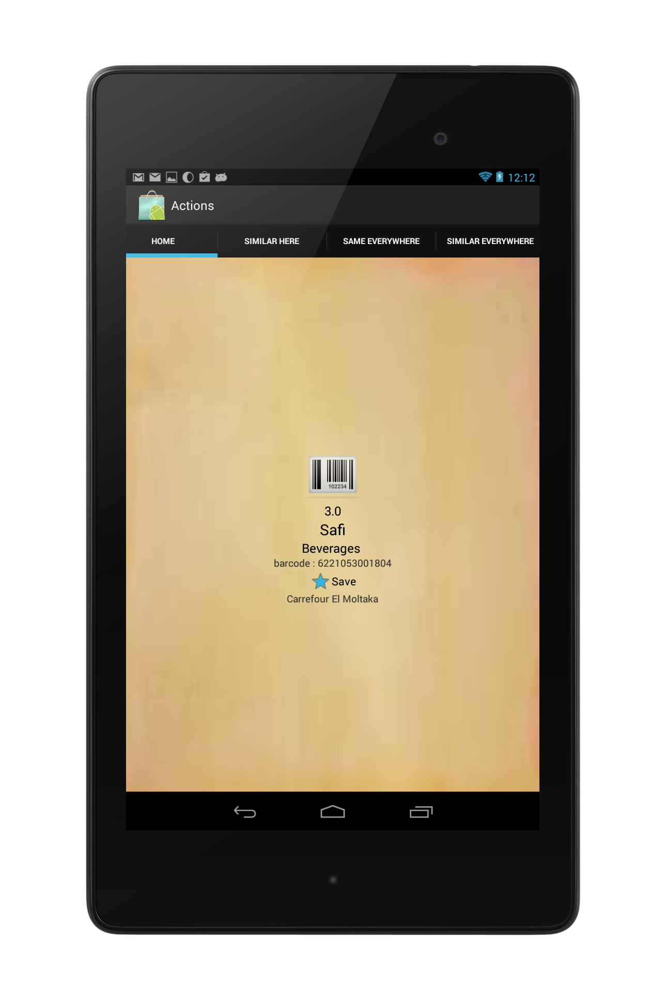
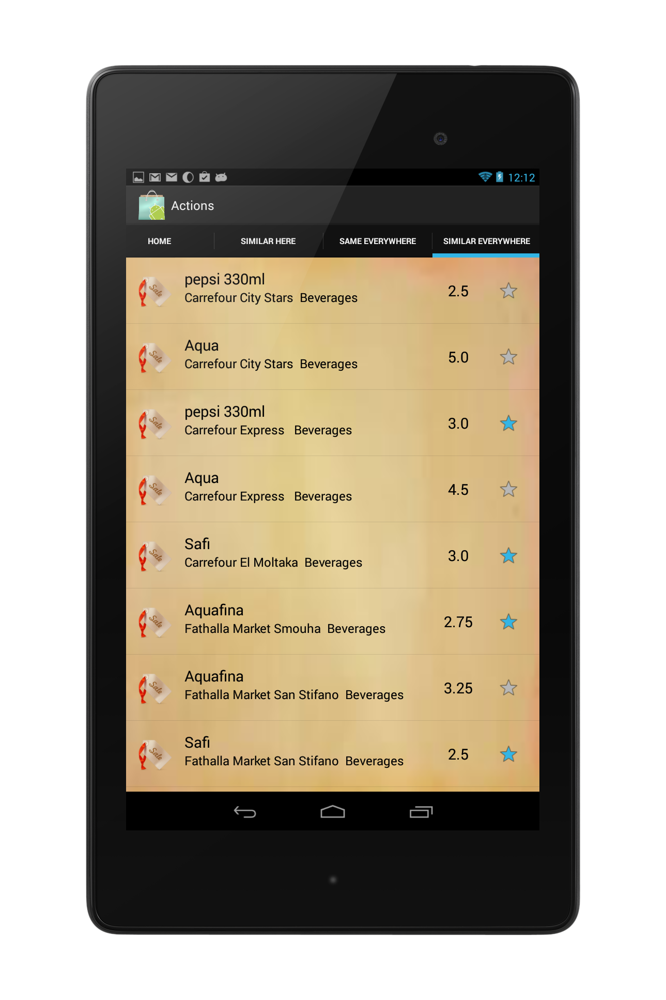
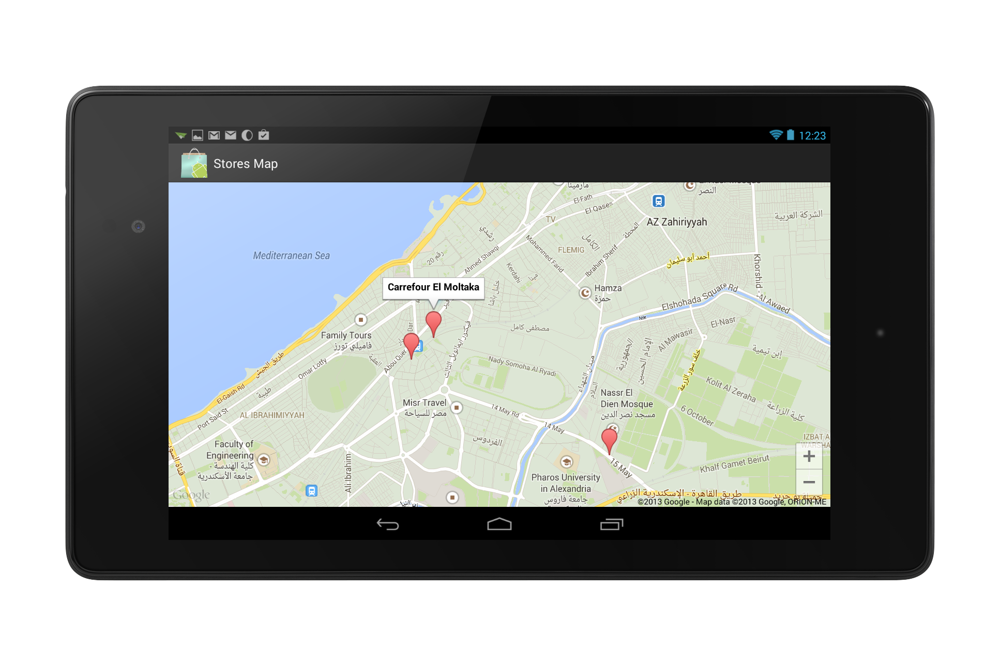

Shopping-Droid 0.1
==================

Database integrated, and barcode reader android app that provides location based information about scanned item

This project is under [GPL3](http://www.gnu.org/licenses/gpl.html) License except that commercial use is not allowed.

please check [screen shots](#screen-shots)

Feature List
============

### Barcode scanner ###
> + Use android phone to scan a product's barcode to use it in finding information about this product.
	           
### Web Interface
> + query the server from web browser using different ending URL

### Recommendation of similar products ###
> + same product in other stores
> + similar products (same type, near price) in same store
> + similar products in all stores
    
### History of scanned items ###
> + Saving the current store 
> + Also saving information ( product bought, its price, ... etc)
> + Keep the last 20 scanned items for example

### Favourite list ###
> + Save favorite items on device for offline usage.
> + Insert new entries on device offline DB for later usage.
> + Also can be FK on that entry in the main DB.

### Store location finder ###
> + Search for nearby stores. 
+ Using GPS to locate your position, and using Google Maps to show you location of the stores.
+ current store is determined by current user location, if the user was not in a store the nearest store is considered the current store

### Application interface ###
> + User friendly interface. posting screenshots soon.

Module List
============

### server side ###
RESTfull API [link](https://en.wikipedia.org/wiki/Representational_state_transfer)
> + MySQL Database  [DB design](online_DB_design.txt) 
> + PHP interface to route queries, Only supported requests are GET requests. Response in JSON format 
> + different ending URLs

### Client Side ###
> + Device sends a GET request to the server using HTTP
> + Server replies with JSON object
> + JSON object is parsed and a list of stores or products is retrieved and displayed to the user. 

### Barcode Scanner ###
Integrated with zXing (zebra crossing) [link](http://code.google.com/p/zxing/)
> + Open source library which has Apache 2.0 license to scan barcodes of products, which can be used to retrieve any necessary information about the product from the Database.

### Stores Map ###
Google Maps Javascript API v3 [link](https://developers.google.com/maps/documentation/javascript/)
> + used for displaying all stores on the map so that the user may find nearby stores to his current location.

### On device database ###
SQLite database 
> + Used to store scannig history (auto cleaning list of the last 20 items scanned)
> + Also used to save a favorite list 

### Location Manager ###
> + Getting current user location based on GPS. 
> + Switching to network provided locaiton if GPS is not available

Screen Shots
============
 

 

